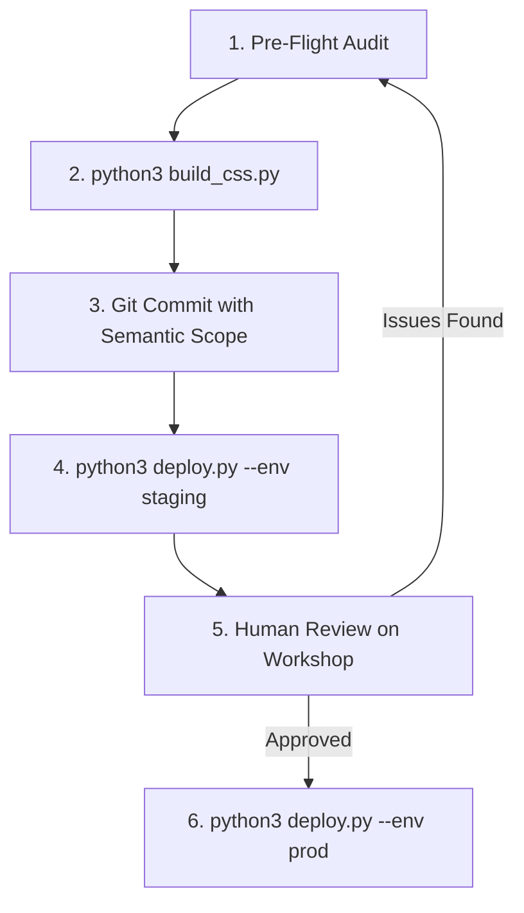

# 🍳 SKILL.md — The Line Cook's Recipes
**System:** Chithramaya Creatives AI Orchestration Core  
**Layer:** 2 of 3 (Execution, Workflows, and Repeatable Recipes)  
**Standard:** Every action must follow these exact step-by-step recipes

---

## Recipe 1: WordPress Page Template Construction

When creating or refactoring a page template (e.g., `template-[slug].php`):

1. **Header & Metadata Declaration:**
   ```php
   <?php
   /**
    * Template Name: [Page Name] — Chithramaya Creatives
    * Template Post Type: page
    * Description: [Purpose-driven description]
    */
   ?>
   <!DOCTYPE html>
   <html lang="en">
   <head>
     <meta charset="UTF-8">
     <meta name="viewport" content="width=device-width, initial-scale=1.0">
     <title>[Page Title] — Chithramaya Creatives</title>
     <meta name="description" content="[Brand-voice meta description]">
     <link rel="canonical" href="<?php echo esc_url(home_url('/[slug]')); ?>">
     <?php wp_head(); ?>
     <!-- Synchronous critical page stylesheet (prevents FOUC) -->
     <link rel="stylesheet" href="<?php echo get_stylesheet_directory_uri(); ?>/assets/css/pages/template-[slug].css">
   </head>
   <body>
   ```
2. **Navigation Insertion & Flexbox Flow:**
   - Call `<?php get_template_part('template-parts/global-nav'); ?>`.
   - Because `.site-header` is `position: fixed`, insert a flex spacer when inside a viewport-height hero:
     ```html
     <div style="height: clamp(54px, 7vh, 70px); width: 100%; flex-shrink: 0;" aria-hidden="true"></div>
     ```
3. **Escaping & Security Checklist:**
   - URLs: `esc_url( get_field('field_name') ?: 'fallback' )`
   - Attributes: `esc_attr( ... )`
   - Plain text: `esc_html( ... )`
   - Rich markup: `wp_kses_post( ... )`
4. **Footer & Scripts:**
   - Include `<?php get_template_part('template-parts/global-footer'); ?>` (or inline brand footer).
   - Always conclude with `<?php wp_footer(); ?> </body></html>`.

---

## Recipe 2: CSS Architecture & SMACSS Compilation

1. **Token Hierarchy:**
   All components must consume CSS variables mapped from `theme.json` in `chitramaya/assets/css/base/critical.css`:
   ```css
   :root {
     --color-bg:      var(--wp--preset--color--chitramaya-base-light, #F7F4ED);
     --color-dark:    var(--wp--preset--color--chitramaya-text-dark, #171E4A);
     --color-accent:  var(--wp--preset--color--chitramaya-accent-vibrant, #35A248);
     --color-yellow:  var(--wp--preset--color--chitramaya-yellow, #FAB417);
     --color-white:   var(--wp--preset--color--chitramaya-pure-white, #FFFFFF);
     --font-primary:  'Lato', sans-serif;
     --font-serif:    'Roboto Slab', serif;
   }
   ```
2. **Building Style Bundle:**
   Run the SMACSS compiler whenever global CSS modules are modified:
   ```bash
   python3 build_css.py
   ```
   *Expected output: Wrote ~80KB to `chitramaya/style.compiled.css`.*

---

## Recipe 3: Pre-Flight Design Audit & Stress Testing (Grilling)

Before any commit or deployment, run this 5-point audit checklist:

```
[ ] 1. CONTRAST VALIDATION:
       Verify no white text on light backgrounds or dark text on dark backgrounds.
       Check: pipeline headings, footer logo, ghost watermarks, card sublines.
[ ] 2. TYPOGRAPHY SCALE:
       Display >= 32px / 2.5rem
       Section Headings >= 20px
       Body text >= 14px (desktop target: 15px-16px)
       Labels & Tags >= 12px with uppercase + letter-spacing (0.05em-0.15em)
[ ] 3. ZERO HARDCODED HEX / BLACK:
       Run grep to ensure no unauthorized hex codes (#000, #111, #333, #e2e2e8):
       grep -iE "#000000|#111111|#333333|#e2e2e8" chitramaya/assets/css/pages/*.css
[ ] 4. PHP SYNTAX VALIDATION:
       php -l chitramaya/template-[slug].php
[ ] 5. RESPONSIVE BREAKPOINT AUDIT:
       Verify desktop (1200px+), tablet (900px), and mobile (600px / 380px) layouts.
```

---

## Recipe 4: Deploy & Release Pipeline

Execute in exact sequence:



1. **Compile CSS:**
   `python3 build_css.py`
2. **Commit with Semantic Message:**
   ```bash
   git add -A
   git commit -m "scope: clear description of changes

   Detailed breakdown of modifications:
   - Component A updated
   - Fix applied to Component B"
   git push origin master
   ```
3. **Deploy to Staging (The Workshop):**
   ```bash
   python3 deploy.py --env staging
   ```
   *Verify URL: `https://chithramaya.charnithi.com/[page-slug]`*
4. **Deploy to Production (The Showroom):**
   *(Only upon explicit user confirmation)*
   ```bash
   python3 deploy.py --env prod
   ```
   *Live URL: `https://chithramaya.com/[page-slug]`*

---

## Recipe 5: Automated Testing Suite

1. **PHPUnit Backend Tests (Proofing & Gallery Plugins):**
   ```bash
   cd /home/charlie/Games/Projects/chitramaya/wp-content/plugins/chitramaya-proofing
   ./vendor/bin/phpunit
   ```
2. **Playwright E2E UI Tests:**
   ```bash
   cd /home/charlie/Games/Projects/chitramaya/wp-content/plugins/chitramaya-proofing
   npm run test:e2e
   ```
